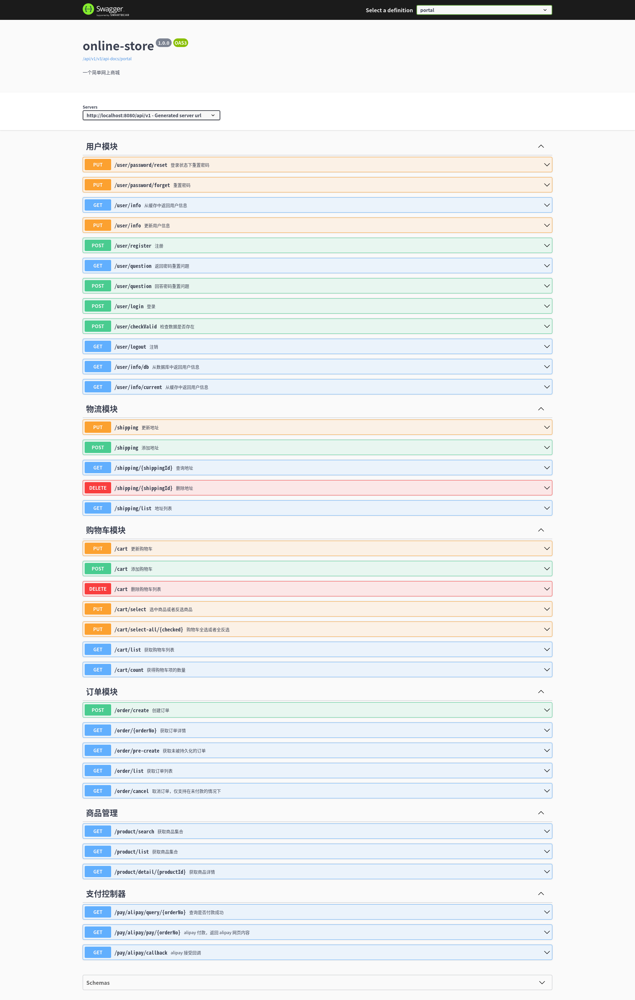
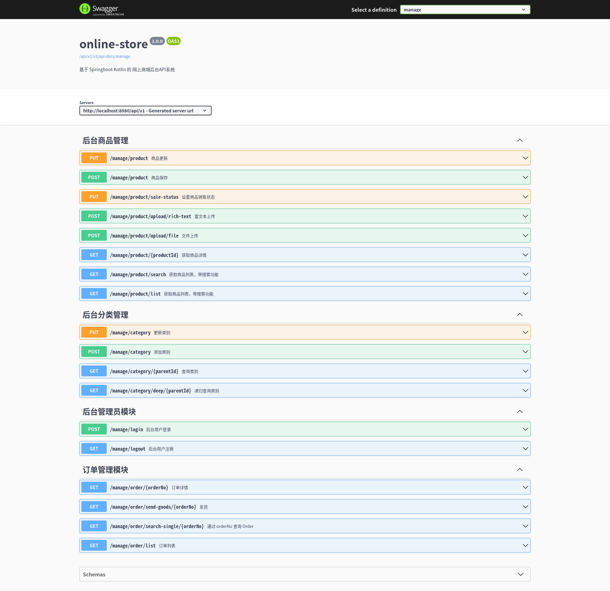

# 网上商城

> 基于 Springboot Kotlin 的 网上商城后台API系统

## Api示例图

### 前台api

### 后台api

## 技术栈

1. OpenJDK-17
2. SpringBoot v2.7.7
3. MyBatis-Plus v3.5.5
4. Kotlin v1.9.22
5. Logback + SLF4J 日志系统
6. Maven 构建工具
7. SaToken 权限控制
8. Swagger3 API文档 (基于Springdoc v1.6.12)
9. 使用 WangEditor 富文本编辑器
10. 接入 Alipay 接口

## 架构

1. MVC架构
2. 利用拦截器权限控制
3. 全局异常处理
4. 缓存服务器(caffeine) + token 解决跨域问题(不适用Session)

## 计划

> 未实现

- [ ] MapStruct 作为模型的映射器实现

## 约定

### 请求头

| 请求头名称          | 介绍                                                         |
| ------------------- | ------------------------------------------------------------ |
| authorization-token | 如果某个api需要登录，请在请求头中带上此token 可以通过 `/user/login` 接口拿到 `authorization-token`，过期时间为12h |

### 响应码

| Code | Msg              | Desc                 |
| ---- | ---------------- | -------------------- |
| 0    | SUCCESS          | 操作成功，无业务异常 |
| 1    | ERROR            | 出现错误             |
| 10   | NEED_LOGIN       | 尚未登录             |
| 2    | ILLEGAL_ARGUMENT | 传入参数非法         |

### 分页数据

| Code    | Desc             |
| ------- | ---------------- |
| size    | 每页显示条数     |
| current | 当前页           |
| pages   | 当前分页总页数   |
| record  | 分页对象记录列表 |
| total   | 总条数           |

### 用户权限

| Code | Desc     |
| :--- | :------- |
| 0    | 管理员   |
| 1    | 普通用户 |

### 商品状态

| Code | Desc |
| :--- | :--- |
| 1    | 在售 |
| 2    | 下架 |
| 3    | 删除 |

### 商品类别

| parent_id | Desc                                     |
| --------- | ---------------------------------------- |
| 0         | 表示是分类的根节点，如：数码3C、酒水饮料 |
| 1xxxxx    | 表示是 1xxxxx 的子分类                   |

### 支付平台

| Code | Desc   |
| ---- | ------ |
| 1    | 支付宝 |
| 2    | 微信   |

### 订单状态

| Code | Desc     |
| ---- | -------- |
| 0    | 已取消   |
| 10   | 未支付   |
| 20   | 已付款   |
| 40   | 已发货   |
| 50   | 订单完成 |
| 60   | 订单关闭 |

### 支付状态

| Code | Desc     |
| ---- | -------- |
| 1    | 在线支付 |

### 是否选中

> 购物车项是否被选中之类的

| Code | Desc   |
| ---- | ------ |
| 1    | 选中   |
| 0    | 未选中 |

### 排序规则

| Code | Desc |
| ---- | ---- |
| asc  | 升序 |
| desc | 降序 |